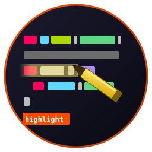

# highlight



  

Lightweight syntax highlighter for the Fe₂O₃ Rust terminal suite. Hand-rolled, no `syntect` dependency, ~30 KB compiled. Ships ANSI-colored text for **18 source languages**, plus dedicated renderers for **HyperList**, **Markdown**, **LaTeX**, **plain text** (URLs / emails / TODO), and **email composition** (RFC 822 headers, quote levels, signature, inline tokens).

<br clear="left"/>

Crate name on crates.io: `fe2o3-highlight`. Imports as `highlight` via `[lib] name`.

## Why this exists

Three Fe₂O₃ apps need to color text identically:

- **[pointer](https://github.com/isene/pointer)** previewing files in its right pane
- **[scribe](https://github.com/isene/scribe)** rendering source files in its editor view + composing email
- **[kastrup](https://github.com/isene/kastrup)** rendering email bodies in its right pane

Without a shared crate, each app drifts to its own color rules. With one, an email opened in kastrup and the same email replied to in scribe show byte-for-byte identical text. A `.rs` file previewed in pointer and edited in scribe show the same colors. One source of truth.

## What it does

```rust
use highlight::{highlight, highlight_hyperlist, highlight_markdown, set_theme};

set_theme("monokai");                        // monokai / solarized / nord / dracula / gruvbox / plain

let rust   = highlight(rust_source, "rs", 200);
let hl     = highlight_hyperlist(hl_source, 200);
let md     = highlight_markdown(md_source, 200);
let tex    = highlight_tex(tex_source, 200);
let txt    = highlight_text(txt_source, 200);
```

Each call returns an ANSI-styled `String`. Colors come from a curated 256-color palette, applied through `crust::style::fg` so output composes cleanly with surrounding pane bg.

## Languages

Source code: **Rust, Python, Ruby, JavaScript / TypeScript, Go, C / C++, Bash / Zsh / Fish, Lua, Java / Kotlin / Scala, TOML / YAML / INI, SQL, CSS / SCSS / LESS, HTML / XML, x86 / x86-64 ASM, Perl, XRPN, Zig, HyperList**.

Specialised renderers (smarter than generic source mode):

- **HyperList** (`.hl`) — full token coloring per the [HyperList 2.6 spec](https://github.com/isene/HyperList): operators (ALL-CAPS:), properties (Name:), qualifiers `[...]`, references `<...>`, substitutions `{...}`, parentheticals, hash tags, multi-line indicators
- **Markdown** (`.md`) — headers (H1–H6), bold / italic / code / links / lists, fenced code blocks
- **LaTeX** (`.tex`) — commands, environments, comments, math mode
- **Plain text** (`.txt`, `.log`) — inline URL / email / TODO highlighting

## Email mode

The `email` module renders RFC 822 messages and `.eml` / kastrup compose tempfiles:

```rust
use highlight::{line_style_email, EmailLineStyle, color_emails};

// Per-line block color (header / body / quote level / signature)
let style = line_style_email(line, idx, header_end, sig_start);

// Inline email-address coloring (177 magenta) overlaid on any base color
let with_emails = color_emails(line, Some(outer_fg));
```

Block colors mirror kastrup's right-pane palette **1-for-1**:

| Element | 256-color index |
|---|---|
| `From` / `To` / `Cc` / `Bcc` / `Reply-To` value | 2 (green) |
| `Subject` value | 1 (red) |
| `Date` / `Message-ID` / `In-Reply-To` / `References` | 240 (gray) |
| Quote level 1 (`>`) | 114 (green) |
| Quote level 2 (`>>`) | 180 (tan) |
| Quote level 3 (`>>>`) | 139 (purple) |
| Quote level 4 (`>>>>`) | 109 (light blue) |
| Signature (`-- ` and below) | 242 (gray) |

Header KEY portion (left of `:`) is rendered **bold**. Inline overrides apply on top of any block color: email addresses → 177 (light purple), URLs → 4 (blue) + underline + OSC 8 hyperlink.

## Themes

Six bundled themes (256-color, dark backgrounds):

| Theme | Preview |
|---|---|
| `monokai`   | bright neon, default |
| `solarized` | muted, high-contrast on the right surfaces |
| `nord`      | cool, low-contrast pastels |
| `dracula`   | bright magenta / cyan / yellow |
| `gruvbox`   | warm earthy palette |
| `plain`     | minimal: only comments / punct dimmed |

```rust
highlight::set_theme("dracula");
let names: &[&str] = highlight::available_themes();
```

Theme is stored in a process-global `Mutex` so any caller reading `highlight()` output sees the current theme without explicit threading.

## Install

In your `Cargo.toml`:

```toml
[dependencies]
highlight = { version = "0.1", package = "fe2o3-highlight" }
```

`crust` (`fe2o3-crust`) is required transitively for SGR helpers.

## Build

```bash
PATH="/usr/bin:$PATH" cargo build --release
```

The `PATH` prefix dodges Claude Code's `~/bin/cc` shadowing the C compiler invoked by build scripts.

## Part of Fe₂O₃

Member of the [Fe₂O₃](https://github.com/isene/fe2o3) Rust terminal suite. Sister libraries:

- **[crust](https://github.com/isene/crust)** — TUI panes, ANSI colors, input handling
- **[glow](https://github.com/isene/glow)** — inline images (kitty / sixel / w3m / braille)
- **[orbit](https://github.com/isene/orbit)** — moon phases, ephemeris

## License

Public domain (Unlicense). Borrow or steal whatever you want.

— [Geir Isene](https://isene.com)
